<p align="center"><a href='https://docs.oracle.com/en/java/javase/8'>
</a>
    <a href='https://docs.spring.io/spring-boot/docs/2.6.2-SNAPSHOT/reference/html'>

</a>
    <a href='https://staging-cn.vuejs.org'>

</a><br/>
    <a href='#'></a>
    <a href='#'></a>
    <a href='#'></a>
    <a href='#'></a>
</p>

# 音乐网

#### 项目说明

+ 此项目为音乐网，后端SpringBoot + MyBatis 前端Vue3.0 + TypeScript + Vue-Router + Vuex + Axios + ElementPlus + Echarts

#### 开发环境

Windows

#### 配置环境

| 程序           | 版本        | 说明                       |
|--------------|-----------|--------------------------|
| Jdk          | 1.8.0 161 | Java 开发工具包               |
| Mysql        | 5.5.27    | 关系型数据库                   |
| Apache-maven | 3.9.0     | Java 项目管理和构建工具           |
| Nvm          | 1.10      | Node.js 版本管理器            |
| Node         | 18.15.0   | Node.js JavaScript 运行时环境 |

#### 开发工具

| 工具                       | 版本            | 说明                      |
|--------------------------|---------------|-------------------------|
| IDEA                     | 2022.3.2      | 后前端开发IDE                |
| Git                      | 2.24.1        | 代码托管平台                  |
| Google   Chrome          | 75.0.3770.100 | 浏览器、前端调试工具              |
| Navicat                  | 11.1.13       | 数据库连接工具                 |
| Postman                  | 7.1.0         | 接口测试工具                  |
| VMware   Workstation Pro | 14.1.3        | 虚拟机(未用到或许你会用到)          |
| PowerDesigner            | 15            | 数据库设计工具(未用到或许你会用到)      |
| SQLyog                   | 12.0.3        | 数据库连接工具 (未用到或许你会用到)     |
| Visio                    | 2013          | 时序图、流程图等绘制工具(未用到或许你会用到) |
| ProcessOn                | ——            | 架构图等绘制工具(未用到或许你会用到)     |
| XMind   ZEN              | 9.2.0         | 思维导图绘制工具(未用到或许你会用到)     |
| RedisDesktop             | 0.9.3.817     | redis客户端连接工具(未用到或许你会用到) |

#### 编码规范

- 规范方式：严格遵守阿里编码规约。
- 命名统一：简介最大程度上达到了见名知意。
- 分包明确：层级分明可快速定位到代码位置。
- 注释完整：描述性高大量减少了开发人员的代码阅读工作量。
- 工具规范：使用统一jar包避免出现内容冲突。
- 代码整洁：可读性、维护性高。

#### 包结构

```
 +- music-client -- 客户端项目
    +- public
        +- favicon.ico -- 网站的图标文件
        +- index.html -- 应用程序的主页面
    +- src
        +- api -- 存放与后端 API 交互的模块
        +- assets -- 静态资源文件 如图片、字体等
        +- components -- Vue 组件
        +- enums -- 存放枚举类型的文件
        +- mixins -- 存放混入的 Vue 代码
        +- router -- 路由配置
        +- store -- 存放 Vuex 状态管理器的相关代码
        +- utils -- 存放一些公共的工具函数或类
        +- views -- 存放页面级组件
        +- App.vue -- 根组件 协调整个应用程序的视图和管理应用程序的状态
        +- main.js -- 项目的入口文件
        +- shims-vue.d.ts -- 定义 Vue 类型的声明文件
    +- .browserslistrc --  定义项目支持的浏览器范围
    +- .eslintrc.js -- ESLint 的配置文件
    +- .gitignore -- 指定需要 Git 忽略的文件或目录
    +- babel.config.js -- Babel 编译器的配置文件
    +- packge.json -- 项目元数据的文件 用于描述 Node.js 应用程序或模块的属性
    +- packge-lock.json -- 锁定当前安装的包的版本号和依赖关系
    +- READE.md -- 项目的相关信息文档
    +- tsconfig.json -- TypeScript 的配置文件，用于指定编译器选项和编译文件列表
    +- vue.config.js -- Vue CLI 的配置文件，用于配置一些构建和开发环境的相关选项
 +- music-manage -- 管理员界面
    +- public
        +- favicon.ico -- 网站的图标文件
        +- index.html -- 应用程序的主页面
    +- src
        +- api -- 存放与后端 API 交互的模块
        +- assets -- 静态资源文件 如图片、字体等
        +- components -- Vue 组件
        +- enums -- 存放枚举类型的文件
        +- mixins -- 存放混入的 Vue 代码
        +- router -- 路由配置
        +- store -- 存放 Vuex 状态管理器的相关代码
        +- utils -- 存放一些公共的工具函数或类
        +- views -- 存放页面级组件
        +- App.vue -- 根组件 协调整个应用程序的视图和管理应用程序的状态
        +- main.js -- 项目的入口文件
        +- shims-vue.d.ts -- 定义 Vue 类型的声明文件
    +- .browserslistrc --  定义项目支持的浏览器范围
    +- .eslintrc.js -- ESLint 的配置文件
    +- .gitignore -- 指定需要 Git 忽略的文件或目录
    +- babel.config.js -- Babel 编译器的配置文件
    +- packge.json -- 项目元数据的文件 用于描述 Node.js 应用程序或模块的属性
    +- packge-lock.json -- 锁定当前安装的包的版本号和依赖关系
    +- READE.md -- 项目的相关信息文档
    +- tsconfig.json -- TypeScript 的配置文件，用于指定编译器选项和编译文件列表
    +- vue.config.js -- Vue CLI 的配置文件，用于配置一些构建和开发环境的相关选项
 +- music-server -- 服务端项目
    +- .mvn
        +- wrapper -- Maven Wrapper 相关文件
            +- maven-wrapper.jar -- Maven Wrapper 的核心 Jar 包
            +- maven-wrapper.properties -- Maven Wrapper 的配置文件
    +- avatorImages -- 存放用户头像图片
    +- img
        +- avatorImages -- 存放用户头像图片
        +- singerPic -- 存放歌手头像图片
        +- songListPic -- 存放歌单封面图片
        +- songPic -- 存放歌曲封面图片
    +- logs -- 存放应用程序日志文件
    +- song -- 存放歌曲文件
    +- sql -- 存放 SQL 脚本文件
    +- src
    |   +- main
    |   |    +- java
    |   |    |    +- com
    |   |    |    |    +- tencent
    |   |    |    |    |    +- music
    |   |    |    |    |    |    +- common -- 存放应用程序通用类
    |   |    |    |    |    |    +- config -- 存放应用程序配置相关的类
    |   |    |    |    |    |    +- constant -- 存放应用程序常量类
    |   |    |    |    |    |    +- controller -- 控制器类 负责接收和处理HTTP请求
    |   |    |    |    |    |    +- dao -- 存放 DAO 接口及其实现类
    |   |    |    |    |    |    +- domain -- 存放实体类
    |   |    |    |    |    |    +- service -- 存放 Service 接口及其实现类
    |   |    |    |    |    |       +- impl -- 存放 Service 接口的默认实现类
    |   |    |    |    |    |    +- MusicApplication.java -- 应用程序入口类
    |   |    +- resources
    |   |       +- mapper
    |   |           +- AdminMapper.xml -- 管理员用户 Mapper 文件
    |   |           +- CollectMapper.xml -- 歌曲收藏 Mapper 文件
    |   |           +- CommentMapper.xml -- 评论 Mapper 文件
    |   |           +- ConsumerMapper.xml -- 普通用户 Mapper 文件
    |   |           +- ListSongMapper.xml -- 歌单包含的歌曲 Mapper 文件
    |   |           +- RankListMapper.xml -- 排行榜 Mapper 文件
    |   |           +- SingerMapper.xml -- 歌手 Mapper 文件
    |   |           +- SongListMapper.xml -- 歌单 Mapper 文件
    |   |           +- SongMapper.xml -- 歌曲 Mapper 文件
    |   |       +- application.properties -- 应用程序的配置信息
    |   |       +- generatorConfig.xml -- MyBatis Generator 的配置文件
    |   |       +- log4j.properties -- log4j 的配置文件
    |   |       +- mysql-connector-java-8.0.13.jar -- MySQL 驱动包
    |   +- test -- 测试代码
    |  	|	+- java
    |  	|	    +- com
    |  	|	        +- tencent
    |  	|	            +- music
    |  	|	                +- MusicApplicationTests.java -- 应用程序测试类
    +- target -- Maven建项目时自动生成的目录
    +- .gitignore -- 指定需要 Git 忽略的文件或目录
    +- LICENSE -- 开源软件的授权协议
    +- mvnw --  Maven Wrapper 的脚本，作用是为了在开发团队中使用一致的 Maven 版本，以及简化在新环境中安装 Maven 的步骤 用于 Linux 或 macOS 系统
    +- mvnw.cmd --  Maven Wrapper 的脚本，作用是为了在开发团队中使用一致的 Maven 版本，以及简化在新环境中安装 Maven 的步骤 用于 Windows 系统
    +- pom.xml -- 用于声明和管理项目依赖的XML文件
    +- README.md -- 项目的相关信息文档
 +- sql脚本 -- 存放 SQL 脚本文件
 +- .gitignore -- 指定需要 Git 忽略的文件或目录
 +- LICENSE -- 开源软件的授权协议
 +- README.md -- 项目的相关信息文档
```

#### 后端技术栈

| 技术                   | 版本                   | 说明                       |
|----------------------|----------------------|--------------------------|
| Spring Boot          | 2.6.2                | 基于 Spring Boot 构建        |
| MySQL                | 8.0.16               | 数据库                      |
| MyBatis              | 1.3.2                | 数据持久层框架                  |
| MyBatis Spring Boot  | 1.1.1                | MyBatis 的 Spring Boot 集成 |
| Apache Commons Lang  | 3.8.1                | 通用工具类库                   |
| FastJSON             | 1.2.47               | JSON 解析库                 |
| Log4j                | 1.3.8.RELEASE, 2.8.2 | 日志库                      |
| Log4j-to-SLF4J       | 2.8.2                | Log4j 到 SLF4J 的桥接        |
| JUnit                | 4.13.1               | 单元测试框架                   |
| Spring Boot DevTools |                      | 热部署模块                    |

#### 前端技术栈

| 技术                               | 版本      | 说明                   |
|----------------------------------|---------|----------------------|
| axios                            | ^0.26.0 | HTTP客户端              |
| core-js                          | ^3.8.3  | JavaScript库          |
| element-plus                     | ^2.0.4  | 基于ElementUI的UI库      |
| vue                              | ^3.2.13 | 渐进式JavaScript框架      |
| vue-router                       | ^4.0.3  | Vue路由框架              |
| vuex                             | ^4.0.0  | Vue状态管理框架            |
| @element-plus/icons-vue          | ^1.0.0  | ElementPlus图标库       |
| @typescript-eslint/eslint-plugin | ^5.4.0  | TypeScript ESlint插件  |
| @typescript-eslint/parser        | ^5.4.0  | TypeScript ESlint解析器 |
| @vue/cli-plugin-babel            | ~5.0.0  | Vue Babel插件          |
| @vue/cli-plugin-eslint           | ~5.0.0  | Vue ESlint插件         |
| @vue/cli-plugin-router           | ~5.0.0  | Vue路由插件              |
| @vue/cli-plugin-typescript       | ~5.0.0  | Vue TypeScript插件     |
| @vue/cli-plugin-vuex             | ~5.0.0  | Vue Vuex插件           |
| @vue/cli-service                 | ~5.0.0  | Vue CLI服务            |
| @vue/eslint-config-typescript    | ^9.1.0  | Vue ESlint配置         |
| eslint                           | ^7.32.0 | 代码规范检查工具             |
| eslint-plugin-vue                | ^8.0.3  | Vue ESlint插件         |
| sass                             | ^1.32.7 | CSS预处理器              |
| sass-loader                      | ^12.0.0 | Webpack Sass加载器      |
| typescript                       | ~4.5.5  | TypeScript编译器        |

#### 项目启动
- 1.数据库：mysql5.6在navicat中运行数据库脚本生成对应的数据库表
- 2.后台启动：导入项目，在src/main/resources/application.yml文件里更改数据库名称或数据库密码,进入控制台，到项目所在路径，执行命令：mvn clean spring-boot:run
- 3.前台启动：导入项目，进入控制台，到项目所在路径，执行命令：npm install 后 npm run serve 输入用户名：234321 密码：123 即可登录
- 4.后台管理界面启动：导入项目，进入控制台，到项目所在路径，执行命令：npm install 后 npm run serve 输入用户名：admin 密码：123 即可登录

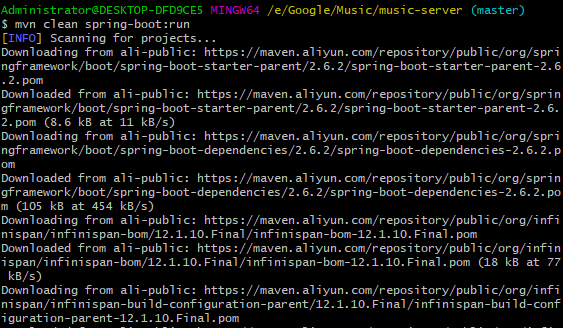

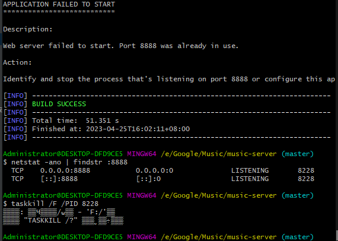

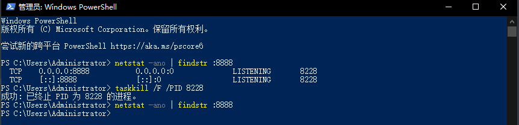

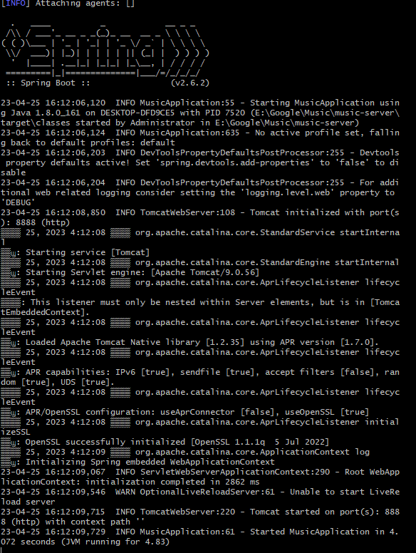

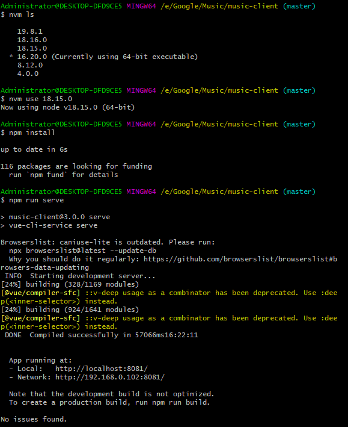

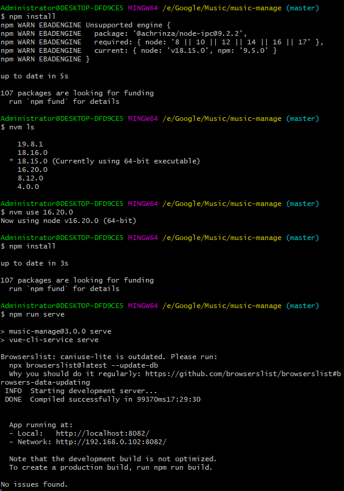

#### 效果展示

+ 客户端


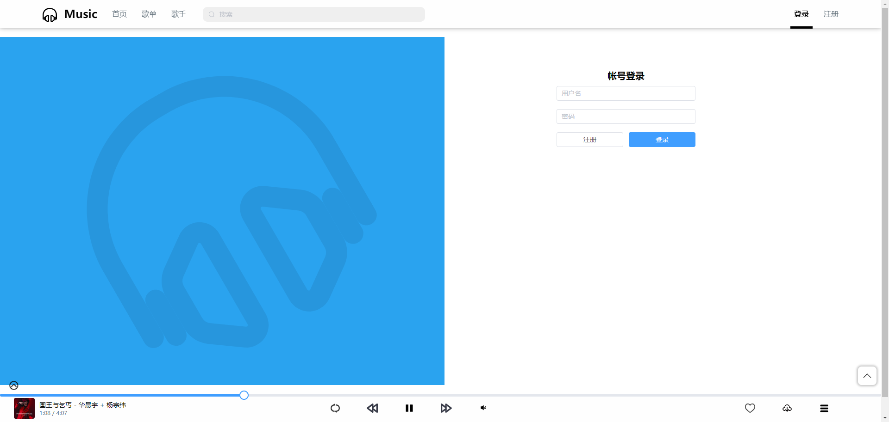

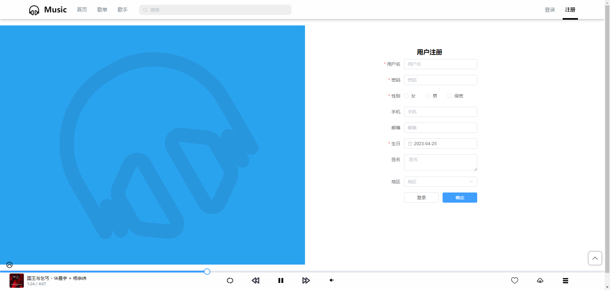

+ 后台管理界面

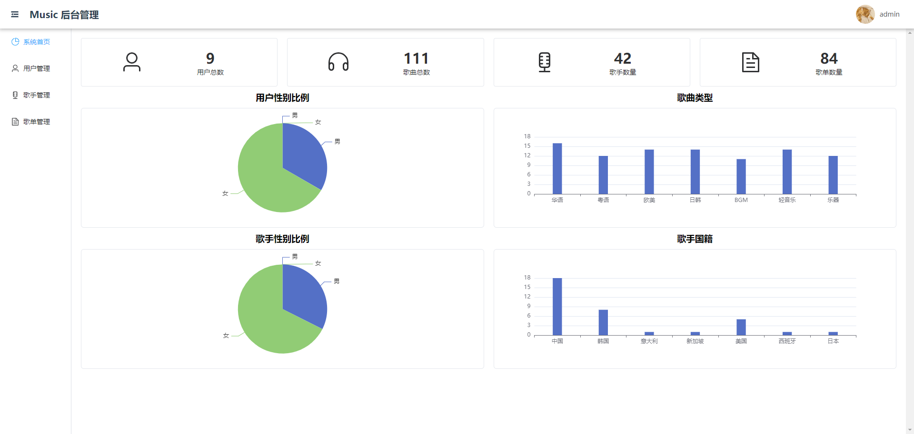

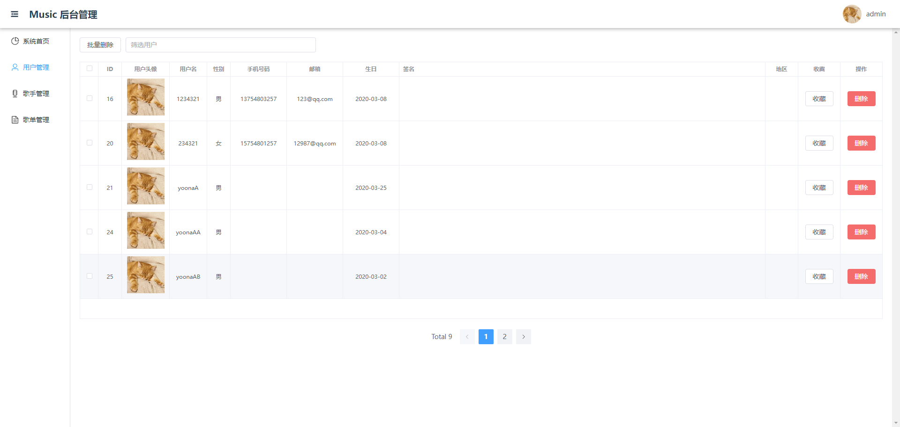

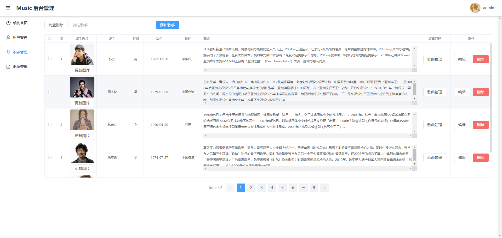

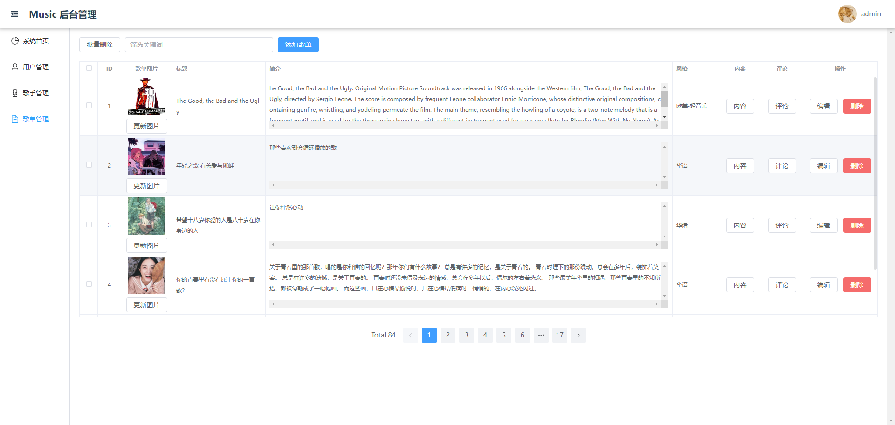

#### 拓展知识

1. [如何将sql文件导入到navicat中？](https://blog.csdn.net/will__be/article/details/107542003)
2. [查看MySql版本号命令](https://blog.csdn.net/qq_38486203/article/details/80324014)
3. [Windows下安装两个版本的Mysql](https://blog.csdn.net/cai_4/article/details/123050478)
4. [使用idea配置本地tomcat](https://blog.csdn.net/baomw/article/details/89385952)
5. [MySQL数据库下载及安装教程（最新版！史上最详细！） ](https://www.cnblogs.com/aishangJava/p/13335254.html)
6. [安装MYSQL自定义安装路径](https://blog.csdn.net/qq_43796994/article/details/120292049)
7. [Maven是什么？ Maven的概念+作用+仓库的介绍+常用命令](https://cloud.tencent.com/developer/article/1705945)
8. [Maven安装与配置](https://blog.csdn.net/qq_38190185/article/details/115921070)
9. [快速用cmd打开环境变量设置页面](https://blog.csdn.net/ljh101/article/details/108906459)
10. [Maven配置完毕后构建失败，无法下载JAR包，输入mvn help:system后出现No plugin found for prefix 'help'...问题的解决方案](https://www.cnblogs.com/byuan/p/14853891.html#p1)
11. [No plugin found for prefix spring-boot in the current project and in the plugin groups异常解决](https://blog.csdn.net/syc000666/article/details/106250117)
12. [ESLint:please specify Node.js interpreter correctly](https://blog.csdn.net/lindali1115/article/details/88027920)
13. [node.js安装及环境配置超详细教程【Windows系统安装包方式】](https://blog.csdn.net/web18224617243/article/details/123191441)
14. [关于idea不能使用npm命令的解决办法](https://blog.csdn.net/lcszz0302/article/details/117069576)
15. [Node.js详细安装教程（2021）](https://blog.csdn.net/m0_67393593/article/details/126038340)
16. [node.js安装及环境配置(保姆级)](https://blog.csdn.net/weixin_54040016/article/details/127207771)
17. [node安装及环境变量配置详细教程](https://www.jb51.net/article/255356.htm)
18. [git强制推送命令](https://blog.csdn.net/weixin_30732825/article/details/101915778)
19. [如何免费拥有自己的个人网页，如何建站上传](https://jingyan.baidu.com/article/454316ab562a7df7a6c03a65.html)
20. [IntelliJ IDEA 怎么全局搜索](https://blog.csdn.net/weixin_46017976/article/details/109405746)
21. [启动springboot项目时报错：​无法访问org.springframework.web.bind.annotation.GetMapping …具有错误的版本 61.0，应为52.0​](https://blog.csdn.net/qq_37958178/article/details/128449480)
22. [pom依赖报错com.mysql:mysql-connector-j:jar:unknown was not found](https://blog.csdn.net/zys_yyds/article/details/128742175)
23. [gitee 图床因外链访问过多被封，我们该怎么办](https://blog.csdn.net/weixin_44062380/article/details/123761358)
24. [解决idea显示properties文件中文乱码](https://blog.csdn.net/qq_38530648/article/details/121672442)
25. [idea的基本操作--idea的重启](https://blog.csdn.net/che_j/article/details/90720716)
26. [mysql serverTimezone](https://blog.csdn.net/Shezzer/article/details/80201264)
27. [SpringBoot在IDEA里实现热部署](https://blog.csdn.net/zhang_m_h/article/details/123652687)
28. [Idea配置热部署](https://blog.csdn.net/qq_16148137/article/details/99694566)
29. [intellij idea修改maven配置 总是恢复默认配置 的解决方法idea版本(2020.2.x) ](https://www.cnblogs.com/xing-29391/p/13519792.html)
30. [Springboot项目删除项目同步target文件问题解决方案](https://www.jb51.net/article/201148.htm)
31. [SpringBoot项目启动错误：错误: 找不到或无法加载主类 com.example.controller.demo.DemoApplication](https://blog.csdn.net/sayhitoloverOvO/article/details/119836748)
32. [IDEA多行编辑](https://blog.csdn.net/qq_22803691/article/details/111180873)
33. [如何修改MySQL数据库名称](https://zhuanlan.zhihu.com/p/264878599)
34. [在 Navicat for MySQL 中如何重命名数据库名](https://www.shuijingwanwq.com/2020/01/21/3899/)
35. [vue cli4 修改静态html的 %= htmlWebpackPlugin.options.title % 默认值](https://www.mulingyuer.com/archives/708/)
36. [笔记本键盘上某些键（例如break键）消失了怎么办？](https://sun-v.github.io/2019/04/29/%E7%AC%94%E8%AE%B0%E6%9C%AC%E9%94%AE%E7%9B%98%E4%B8%8A%E6%9F%90%E4%BA%9B%E9%94%AE%EF%BC%88%E4%BE%8B%E5%A6%82break%E9%94%AE%EF%BC%89%E6%B6%88%E5%A4%B1%E4%BA%86%E6%80%8E%E4%B9%88%E5%8A%9E%EF%BC%9F/)
37. [TypeScript(TS)语法整理](https://blog.csdn.net/qq_41560520/article/details/116595054)
38. [使用IDEA新建一个VUE项目](https://blog.csdn.net/qq_39920329/article/details/105378874)
39. [Vue CLI 🛠️ Vue.js 开发的标准工具](https://cli.vuejs.org/zh/index.html)
40. [package-lock.json的作用以及版本号说明](https://blog.csdn.net/dong123ohyes/article/details/112132459)
41. [你不知道的package.json属性](https://juejin.cn/post/7063290762514923550?utm_source=gold_browser_extension)
42. [常用的package.json，还有这多你不知道的骚技巧](https://zhuanlan.zhihu.com/p/148795036)
43. [用vue-cli搭建项目怎么更换vue的默认版本？](https://tangjiusheng.com/vue/175.html)
44. [印记中文](https://docschina.org/)
45. [vue---style scoped属性的作用和原理、scoped穿透](https://blog.csdn.net/maidu_xbd/article/details/106361205)
46. [CSS background-attachment 属性](https://www.w3school.com.cn/cssref/pr_background-attachment.asp)
47. [async 函数](https://developer.mozilla.org/zh-CN/docs/Web/JavaScript/Reference/Statements/async_function)